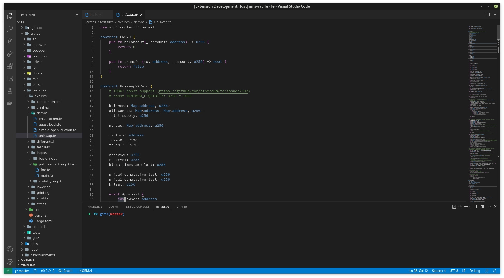

# Felang extension for VS code

Fe is an emerging smart contract language for the Ethereum blockchain. This extension focus support fe lang, help developers have better experience with fe lang.
Welcome any feelback!!!

## Features

- Highlight syntax.
- Snippets 
- Lsp support(early state): diagnotics 

## Note about LSP 
For use LSP, you should do two steps about: 
- First install `fe` compiler from source. You can read more details at [here](https://github.com/vuvoth/fe/blob/master/docs/src/development/build.md)
- Add `fe` compiler to your `PATH`. 

We're tring make it easier for developers <3!

## Screenshots

-----------------------------------------------------------------------------------------------------------

## Fe Social

* [Fe website](https://fe-lang.org/)
* [Fe blog](https://blog.fe-lang.org/)
* [Fe Discord](https://discord.gg/ywpkAXFjZH)
* [Fe Twitter](https://twitter.com/official_fe)

### Happy coding!!!